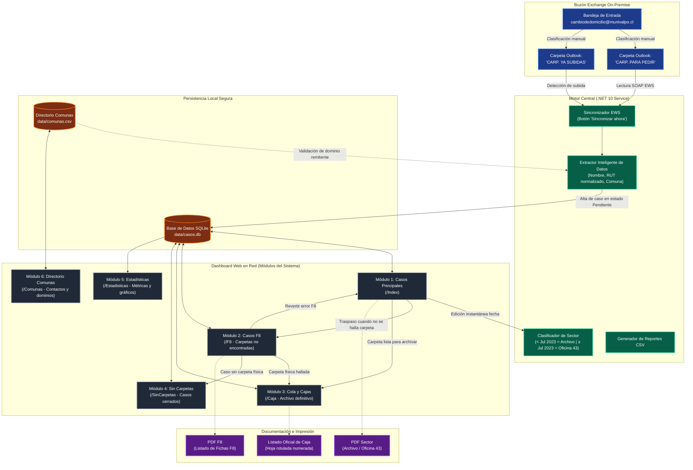
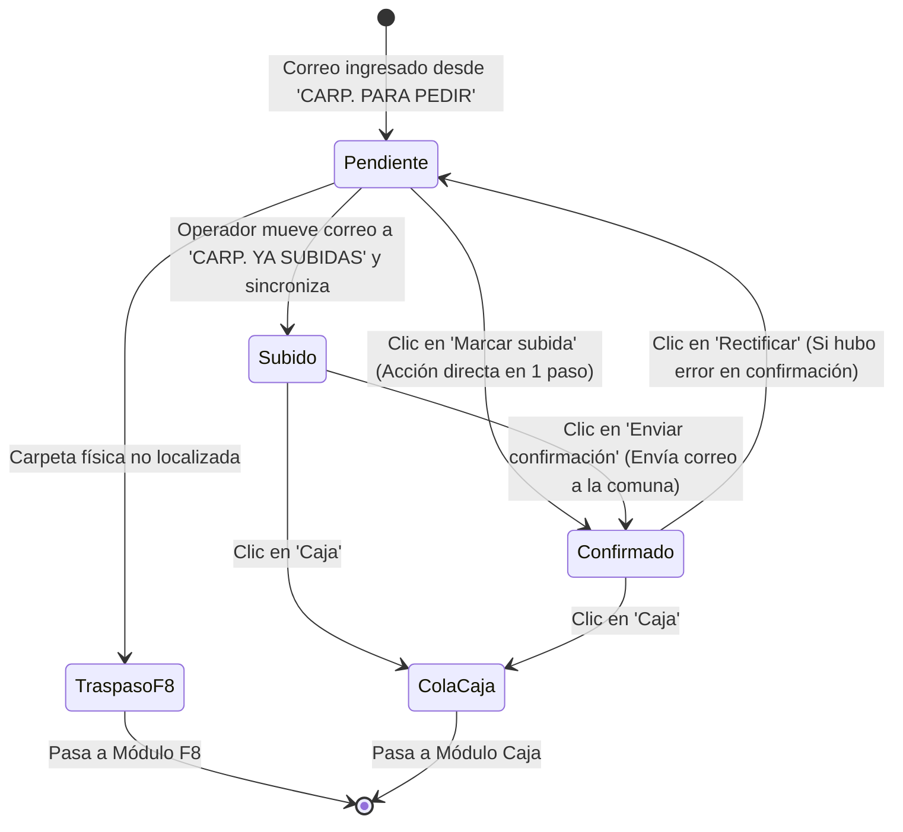
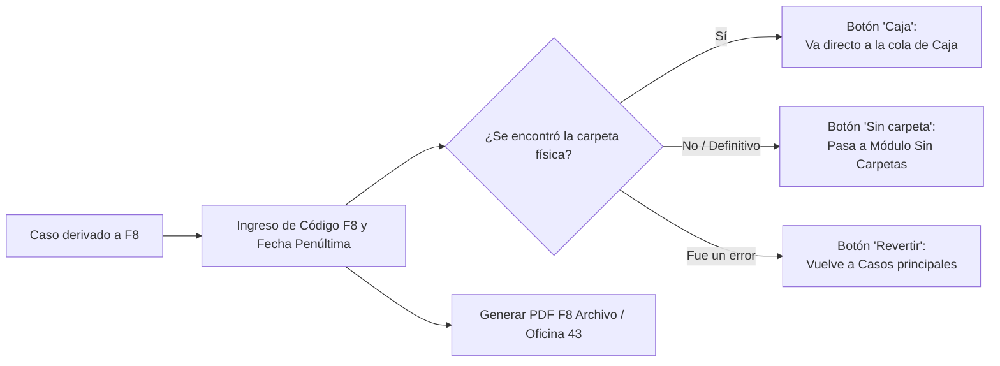
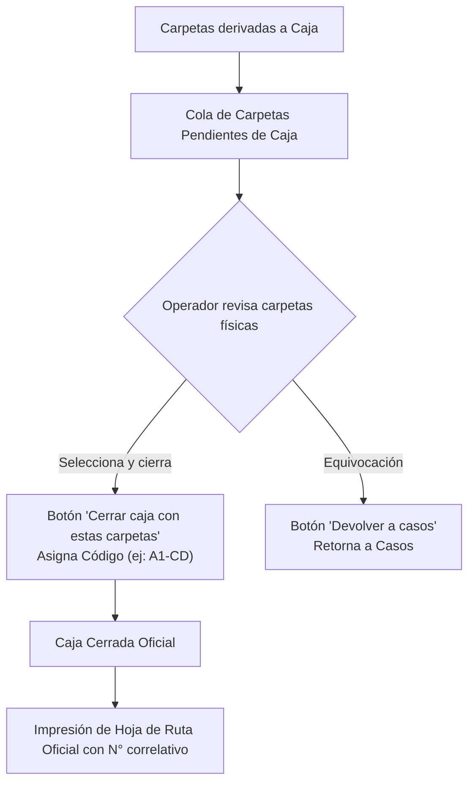
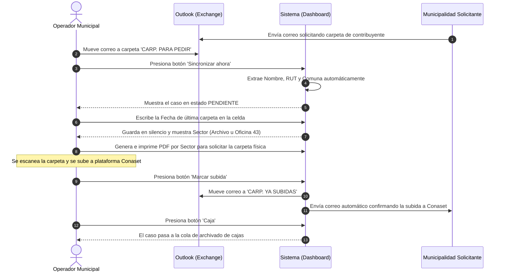

# Manual de Usuario Didáctico — Sistema Cambio de Domicilio

**Municipalidad de Valparaíso — Dirección de Tránsito**  
*Autor y Arquitectura:* Raúl Salazar  
*Versión del Sistema:* .NET 10 LTS — Septiembre 2026  

---

## 1. Visión General: ¿Qué hace el sistema y cómo se interconectan sus módulos?

El sistema **Cambio de Domicilio** gestiona integralmente el ciclo de vida de las solicitudes de carpetas de conductores que se han trasladado a otras comunas del país (trámite Conaset). Conecta el servidor de correo municipal (**Exchange Server**), una base de datos local ultra-rápida (**SQLite**), y una interfaz web moderna en red que permite a los operadores controlar cada paso con máxima fluidez y **sin recargas ni saltos molestos de pantalla**.

### Diagrama de Interconexión de Módulos (Mermaid)

---

## 2. Los 6 Módulos del Sistema en Detalle

### Módulo 1: Cambio de Domicilio (Casos Principales — `/Index`)
Es la pantalla operativa principal donde se reciben y procesan todas las solicitudes normales.

* **Campos editables en celda (sin recargas de página):**
  * **Nombre y RUT:** Edición en línea directa. Al terminar de editar, se guarda automáticamente con confirmación visual verde (pulso de celda) y sin saltos de scroll.
  * **Fecha última carpeta:** Al digitar la fecha (ej: `15/03/2024`), el sistema la valida inmediatamente en segundo plano y actualiza la columna **Sector** de inmediato.
  * **Casillas de selección (Marcar, F8, Pendiente Carpeta):** Mutuamente excluyentes por fila, se guardan silenciosamente.
* **Acciones principales:**
  * **Marcar subida:** Mueve el correo a `CARP. YA SUBIDAS` y envía la confirmación oficial a la comuna de destino en un solo clic.
  * **Caja:** Envía la carpeta física procesada a la cola de archivado de cajas.
  * **Traspaso a F8:** Deriva el caso a la sección F8 cuando no es posible hallar la carpeta física.

---

### Módulo 2: Casos F8 (`/F8`)
Módulo especializado para gestionar expedientes cuyas carpetas físicas no han podido ser localizadas o fichas anteriores al año 2000.

* **Campos con guardado asíncrono:**
  * **Código F8:** Código asignado por el operador (ej. `F8-1052`). Se guarda en la celda con pulso verde sin mover la página.
  * **Fecha penúltima carpeta o S/C:** Admite fechas válidas o la sigla `S/C` (Sin Carpeta).
* **Acciones:**
  * **Marcar subida / Confirmar:** Envía el comprobante con la referencia F8 a la municipalidad solicitante.
  * **Caja:** Si la carpeta física finalmente aparece, se envía directamente a la cola de cajas.
  * **Sin carpeta:** Cierra el expediente sin carpeta física y lo archiva en el módulo respectivo.
  * **Revertir:** Limpia los datos F8 y regresa el caso al flujo habitual.

---

### Módulo 3: Control y Archivo de Cajas (`/Caja`)
Permite registrar y ordenar físicamente las carpetas que ya fueron subidas y confirmadas en cajas rotuladas permanentes.

* **Búsqueda transversal:** Cualquier contribuyente archivado en una caja puede localizarse en segundos desde el buscador general, indicando el **Código de Caja**, la **fecha de cierre** y su **número de orden correlativo** exacto dentro del archivador.

---

### Módulo 4: Sin Carpetas (`/SinCarpetas`)
Registro histórico de todos los expedientes que concluyeron su tramitación sin existencia de carpeta física.
* Permite consulta, auditoría y expedición de certificados históricos.
* Casos blindados para evitar que ingresen por error al circuito de cajas físicas.

---

### Módulo 5: Estadísticas Institucionales (`/Estadisticas`)
Panel de reportería ejecutiva y métricas de desempeño del departamento.
* **Tiempos de respuesta:** Cumplimiento del plazo legal de 15 días hábiles.
* **Distribución por Sector:** Volumen derivado a Archivo vs. Oficina 43.
* **Comunas con mayor demanda:** Gráficos comparativos de solicitudes recibidas por municipalidad.
* **Totalmente en tiempo real:** Lee directamente de la base de datos sin retardos.

---

### Módulo 6: Directorio de Comunas (`/Comunas`)
Directorio de contactos oficiales de las más de 300 municipalidades del país.
* Registra comuna, dominio de correo autorizado (ej: `valparaiso.cl`) y casilla electrónica para el envío de confirmaciones.
* Controla qué correos son reconocidos por el sistema para evitar filtración de spam o correos no institucionales a la pantalla de trabajo.

---

## 3. Resumen de Flujo de Trabajo Operativo Recomendado

---

## 4. Garantías de Estabilidad y Buenas Prácticas

1. **Sin saltos de página ni pérdidas de scroll:** Cada celda editable (`Fecha`, `Código F8`, `Nombre`, `RUT`) utiliza comunicación AJAX asíncrona. Al presionar Tab o salir de la celda, los datos se guardan silenciosamente y se ofrece una animación visual verde de confirmación inmediata.
2. **Sin correos accidentales:** Ninguna notificación o correo hacia otra municipalidad sale sin que el operador presione expresamente el botón correspondiente.
3. **Respaldo integral:** Los datos se encuentran consolidados en `data/casos.db` respaldados y versionados en el repositorio central de GitHub.
